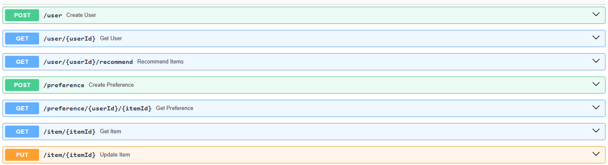
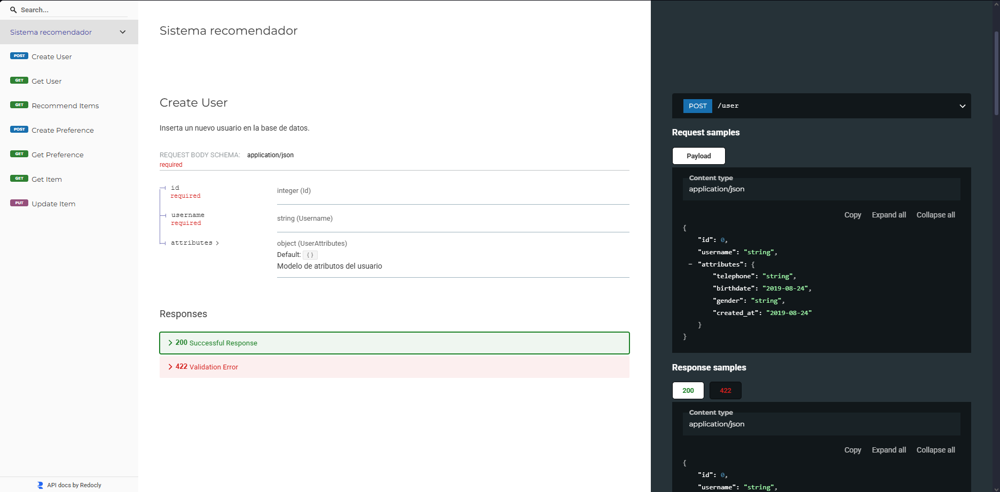
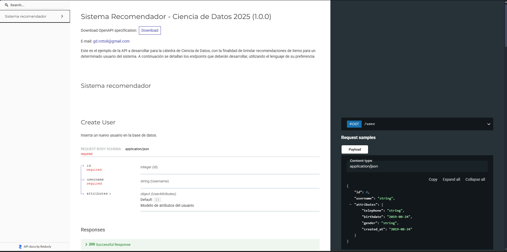

# Universidad Tecnológica Nacional - Facultad Regional Concepción del Uruguay
## Ciencia de datos - Sistema recomendador
Proyecto desarrollado por 
* Emmanuel Davezac
* Nicolas Morales

***

## Introducción
El presente proyecto representa la resolución del Trabajo Práctico Final correspondiente a la materia Ciencia de Datos de la carrera Ingeniería en Sistemas de Información de la UTN-FRCU (Universidad Tecnológica Nacional - Facultad Regional Concepción del Uruguay). 
El mismo es un proyecto de minería de datos resolviendo una problematica utilizando la metodología CRISP-DM e implementando la solución mediante API REST en Python.

***

## Problema
* El trabajo práctico integrador es un trabajo de desarorllo en el que se deberán implementar la metodología CRISP-DM para diseñar un sistema recomendador de algún item de interés para el grupo, como pueden ser libros, revistas, artículos de consumo, o cualquier otro. 

* Supongan un comitente vendedor de estos items a través de una plataforma virtual, y su objetivo de negocio es aumentar las ganancias por ventas en un 10% para el año 2026, en contraste con lo vendido en el año 2025. 

* Este comitente les explica que tiene su sistema desarrollado sobre una web, con un carrusel que muestra a los usuarios un numero de artículos que pueden ser de su interés, y que actualmente muestra artículos aleatorios. El comitente también manifiesta que “hace 25 años que vende los mismos 100 artículos, y que esto no va a cambiar, que por cábala siempre vende 100, no hay forma de que se agreguen items nuevos”. No obstante, también “recibe muchos usuarios nuevos todo el tiempo y que, a ojo de buen cubero, compran siempre alrededor de 7 u 8 artículos cada uno, a lo sumo algunos comprarán 10, pero puede cambiar en cualquier momento, si la situación mejora”.

* Ya que no existe ningún sistema pre-existente, no se cuenta con una base de datos, por lo que se deberá diseñar una que guarde datos de los usuarios, datos de los items y las preferencias. El comitente les manifiesta que no tiene ni idea de estas cosas, y confía en su experticia para hacerlo. 

* Los desarrolladores de la web les proporciona la definición de una API que deberán construir, la cual se adjunta.Cualquier inconveniente o información que necesiten saber, el comitente siempre está disponible para consulta, a través del correo electrónico gd.rottoli@gmail.com

***

## Descripción del sistema
Este proyecto implementa un Sistema Recomendador de filtro colaborativo basado en similitud entre usuarios. 
El sistema fue desarrollado bajo la metodología CRISP-DM e implementado como API REST.
Este se adhiere a la especificación en formato OPEN API proporcionada en la consigna, pero agrega otros endpoints que se creyeron necesarios para tener un mayor control sobre la API.

***

## Endpoints de la API
La API tiene las siguientes funcionalidades
* /user (POST): Endpoint para crear un nuevo usuario.
* /user/{userId} (GET): Endpoint para obtener los datos de un usuario.
* /user/{userId}/recommend (GET): Endpoint para obtener recomendaciones de items para un usuario específico.
* /preference (POST): Endpoint para registrar o actualizar una preferencia de un usuario sobre un ítem.
* /preference/{userId}/{itemId} (GET): Endpoint para obtener la preferencia de un usuario sobre un ítem específico.
* /item/{itemId} (GET): Endpoint para obtener los datos de un ítem específico.
* /item/{itemId} (PUT): Endpoint para actualizar un ítem existente.

***

## Herramientas utilizadas
Las herramientas fueron elegidas para que la implementación sea lo mas sencilla posible y tenga buen rendimiento. Las herramientas utilizadas son:
* Python: Utilizamos este lenguaje de programación porque es sencillo de utilizar, tiene muchas librerias utiles, es multiplataforma (Se puede usar en varios sistemas operativos o en docker),es versatil ya que lo podemos usar para la mineria de datos y para crear la API, tenemos experiencia utlizandolo y es el mismo que utilizamos en Google Collab, utilizaremos un entorno virtual para no tener problemas con las librerias ya instaladas en el host.
* Jupyter Notebook: Esta herramienta nos permite tener dentro del mismo archivo todo el desarrollo de CRISP-DM, tanto el texto como el codigo en Python y estructurar todo mediante titulos. Inicialmente utilizamos Google Collab para el desarrollo de CRISP-DM, pero luego nos pasamos a Jupyter Notebook en un entorno local dentro de Visual Studio Code para mas comodidad y para trabajar tanto el desarrollo como la implementación dentro del mismo entorno virtual.
* FastAPI: Para implementar la API, tambien contemplamos utlizar el framework FLASK, pero elegimos FastAPI por ser mas simple, mas ligero y porque genera documentación automaticamente (SWAGGER y ReDoc).
* Uvicorn: es un servidor ASGI (Asynchronous Server Gateway Interface) para aplicaciones Python, que permite ejecutar frameworks web asíncronos como FastAPI y es ideal para desarrollo por su opción de recarga automática
* SQLite: Para implementar la base de datos, porque no necesita un servidor externo para la base de datos, lo que nos simplifica la implementacion.
* Pandas: Para la manipulacion de datos, en versiones iniciales usamos Polars, pero terminamos usar Pandas porque teniamos mas experiencia con esta.

***

## Consideraciones 
* Como no se indican explicitamente los productos en la documentacion, creamos 100 productos genericos para la demostración del sistema. En este caso son libros, pero este programa funciona para cualquier tipo de items siempre que se respete el formato.
* Creamos un conjunto de 700 usuarios para la demostracion del sistema.
* Creamos aproximadamente 5600 preferencias de manera aleatoria entre los Usuarios y los Items para la demostración del sistema.
* Estos conjuntos se pueden reemplazar por datos verdaderos.

***

## Características del sistema
* Filtro Colaborativo Basado en Usuarios: Se enfoca en encontrar usuarios con gustos similares para generar recomendaciones.
* Medición de Preferencias mediante ratings: Se utiliza un valor numérico (preference_value) para cuantificar la interacción del usuario con el ítem.
* Manejo de Cold Start: Para usuarios sin preferencias registradas (usuarios nuevos), el sistema recurre a los ítems más vendidos o más populares en toda la plataforma.

***

## Tutorial de instalación y ejecución de la API
Este tutorial detalla los pasos para instalar las dependencias y ejecutar la API de recomendación en tu entorno local.
El tutorial esta creado para la ejecucion de la api en Windows, por lo que puede que difiera un poco en otro sistema operativo.

### Requisitos iniciales
Asegúrate de tener instalado lo siguiente en tu sistema:
* Python 3.8+

### Configuramos el entorno virtual
Creamos el entorno virtual
```console
python -m venv venv
```
Lo activamos
```console
venv\Scripts\activate
```

Una vez activado, verás (venv) al inicio de la línea de comandos, indicando que estás trabajando en un entorno aislado.

### Instalar dependencias
```console
pip install -r requirements.txt
```

### Ejecución del servidor
1. Iniciar la API
Ejecuta la API usando el servidor Uvicorn:
```console
uvicorn API:app --reload
```
* api: Es el nombre del archivo Python.
* app: Es el nombre de la instancia de FastAPI dentro de ese archivo.
* --reload: Útil para que el servidor se reinicie automáticamente si haces cambios en el código.

2. Acceder a la Documentación
Una vez que veas el mensaje de que Uvicorn está corriendo, la API está lista.
*  Podemos probar la API desde la Documentación interactiva generada automaticamente por FastAPI ingresando a http://127.0.0.1:8000/docs, esta documentación interactiva se puede utilizar para explorar y probar los endpoints en tiempo real. 
Aqui vamos a ver todos los endpoints, ejemplos de como usarlo y vamos a poder probarlos para entender mejor la API.



* Tambien podemos acceder a la documentación generada mas detallada ingresando a http://127.0.0.1:8000/redoc


* Esta pagina tambien nos permite descargar la especificación de la API en formato Open API


3. Usar la API
La URL de acceso de la api es 
```python
http://127.0.0.1:8000
``` 
Podemos probar la API con herramientas como Thunder Client, Postman o consumirla usarla mediante codigo.

## Aplicación web interactiva: Bookverse

Esta es una interfaz gráfica simple para probar y validar el recomendador de libros en tiempo real. Sirve para que el usuario pueda iniciar sesión con perfiles de prueba, calificar libros del catálogo y ver cómo se recalculan las recomendaciones y estadísticas al instante.

### Cómo acceder y probar la aplicación:
1. Iniciar la API en la consola:
   ```console
   uvicorn API:app --reload
   ```
2. Entrar desde el navegador a: http://127.0.0.1:8000/static/index.html
3. Hacer clic en "Ver usuarios de prueba (Demo)" y seleccionar cualquier usuario para interactuar con el sistema recomendador.
